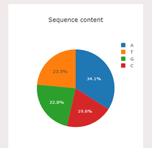
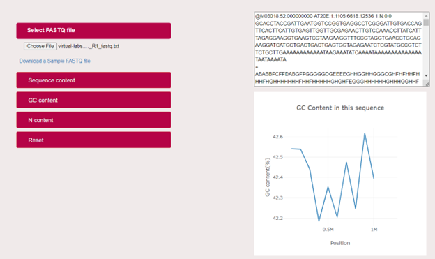
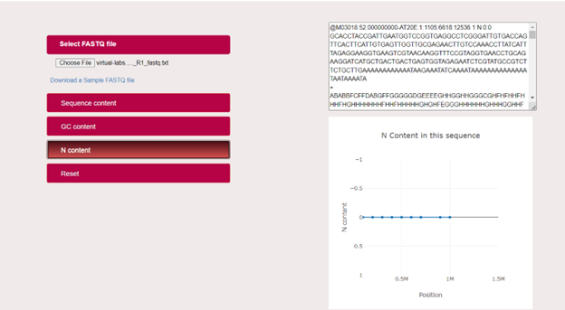

## Procedure

User can analyse the Sequence content (Nitrogenous base pairs-Adenine, Thymine, Guanine and Cytosine), GC content and Nucleotide content of a FASTQ file of a DNA molecule using the developed FASTQ analyser GUI. Steps to use the simulator is as follows:

1.	Open the simulator window

2.	To analyse the contents of a DNA molecule, User have to upload a FASTQ file.

3.	User can also download a sample FASTQ file from the given link provided in the simulator.

4.	User can analyse the sequence content of a DNA molecule by clicking on the Sequence content (Adenine, Thymine, Guanine and cytosine) tab in the simulator.

  In the simulator, user can analyse the nitrogenous bases in percentage, for example,in the given sample FASTQ file, the percentage of the base pairs is as follows:
    Thymine: 30.1% (blue colour)
    Adenine: 24.9%(Orange colour)
    Guanine: 23.7%(Green colour)
    Cytosine: 21.3%(Red colour)
5. User can analyse the guanine-cytosine content(GC Content-in %) of a DNA molecule by clicking on the GC Content tab in the simulator

6. User can analyse the GC content of the given sample file in a graphical plot with GC content (%) in the Y-axis and Position (sequence length) in the X-axis.

7. User can analyse the Nucleotide content (N Content-in %) of a DNA molecule by clicking on the N Content tab in the simulator.

8. User can analyse the Nucleotide content of the given sample file in a graphical plot with N content (%) in the Y-axis and Position (sequence length) in the X-axis.

9. After analysing the Sequence content ,GC content and Nucleotide content of the given DNA sample, User can go to the home page of the Graphical user interface, by clicking on Reset Button.
